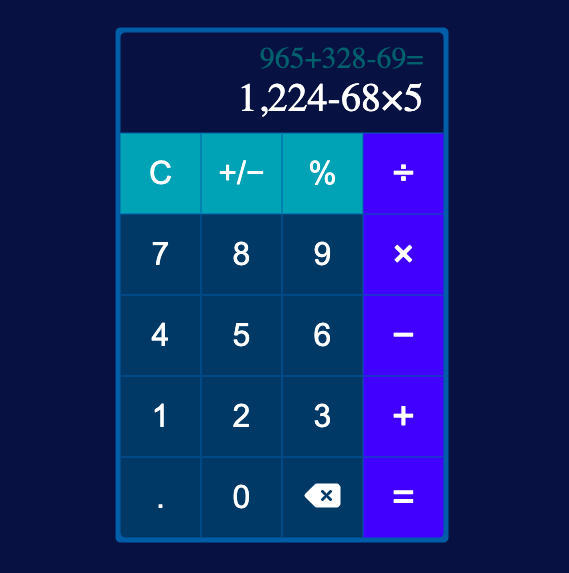

# Calculator

A minimalistic calculator to serve your basic math needs! It can do all basic math operations, as well as change the current number from positive to negative (and vice versa) and give the percentage of the current number to include in your calculation.

**Find the project here!** https://sierragreen379.github.io/Calculator

<!-- ## How It's Made:

**Tools Used:** HTML, CSS, JavaScript

## Lessons Learned:
-  -->